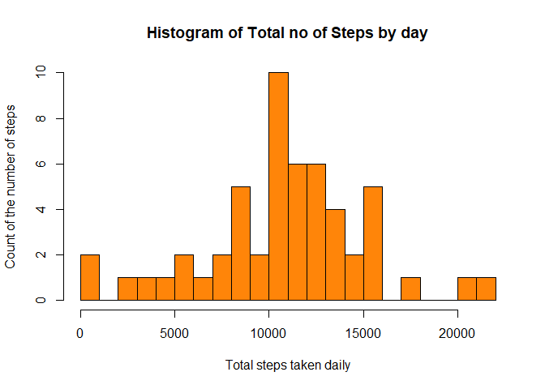
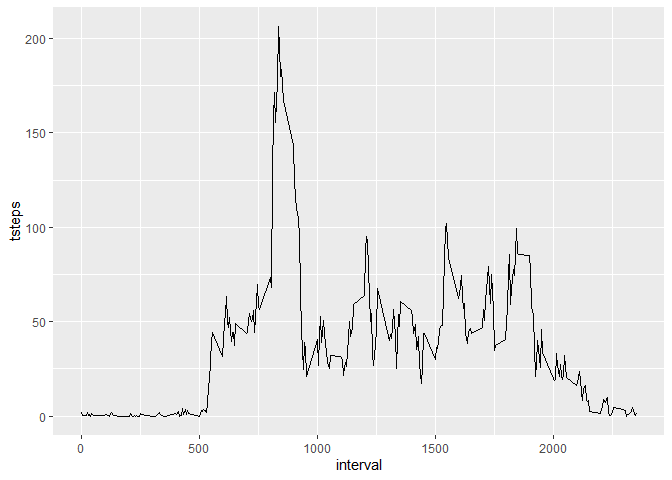

## Loading and preprocessing the data

We are going to load, extract and read the data from the dataset [Activity monitoring data](https://d396qusza40orc.cloudfront.net/repdata%2Fdata%2Factivity.zip)


```r
# This section deals with the downloading the compressed file and
# extracting it contents.

dataFile <- "https://d396qusza40orc.cloudfront.net/repdata%2Fdata%2Factivity.zip"

download.file(dataFile, destfile = "./activity.zip")

unzip(zipfile = "./activity.zip", exdir = "./activity")
```

The above step is an one time operation, verify if the folder and its contents have been extracted to the appropriate location  once done.

Reading the contents of the uncompressed folder.

```r
# Reading the contents of the file
readActivityData <- read.csv("../activity/activity.csv")

summary(readActivityData)
```

```
##      steps            date              interval     
##  Min.   :  0.00   Length:17568       Min.   :   0.0  
##  1st Qu.:  0.00   Class :character   1st Qu.: 588.8  
##  Median :  0.00   Mode  :character   Median :1177.5  
##  Mean   : 37.38                      Mean   :1177.5  
##  3rd Qu.: 12.00                      3rd Qu.:1766.2  
##  Max.   :806.00                      Max.   :2355.0  
##  NA's   :2304
```

```r
head(readActivityData)
```

```
##   steps       date interval
## 1    NA 2012-10-01        0
## 2    NA 2012-10-01        5
## 3    NA 2012-10-01       10
## 4    NA 2012-10-01       15
## 5    NA 2012-10-01       20
## 6    NA 2012-10-01       25
```
Omitting the null values in the data and saving it to a new Variable


```r
activityCompleteData <- na.omit(readActivityData)

head(activityCompleteData)
```

```
##     steps       date interval
## 289     0 2012-10-02        0
## 290     0 2012-10-02        5
## 291     0 2012-10-02       10
## 292     0 2012-10-02       15
## 293     0 2012-10-02       20
## 294     0 2012-10-02       25
```

## What is mean total number of steps taken per day?

Here we can split this up into 2 parts: 
1) We find the total number of steps. 
2) We find the mean of the total number of steps


```r
library(dplyr)
```

```
## 
## Attaching package: 'dplyr'
```

```
## The following objects are masked from 'package:stats':
## 
##     filter, lag
```

```
## The following objects are masked from 'package:base':
## 
##     intersect, setdiff, setequal, union
```

```r
totalSteps <- activityCompleteData %>% select(date, steps) %>% group_by(date) %>% summarize(tsteps= sum(steps))
```

```
## `summarise()` ungrouping output (override with `.groups` argument)
```

```r
hist(totalSteps$tsteps, xlab = "Total steps taken daily", ylab = "Count of the number of steps", main="Histogram of Total no of Steps by day", breaks = 20, col = "#FF8509" )
```

<!-- -->

Now to calculate the mean of the steps


```r
mean(totalSteps$tsteps)
```

```
## [1] 10766.19
```
Median of the steps

```r
median(totalSteps$tsteps)
```

```
## [1] 10765
```

## What is the average daily activity pattern?

Time series plot of the 5-minute interval is as below


```r
library(ggplot2)

head(activityCompleteData)
```

```
##     steps       date interval
## 289     0 2012-10-02        0
## 290     0 2012-10-02        5
## 291     0 2012-10-02       10
## 292     0 2012-10-02       15
## 293     0 2012-10-02       20
## 294     0 2012-10-02       25
```

```r
five_min_interval <- activityCompleteData %>% select(interval, steps) %>% na.omit() %>% group_by(interval) %>% summarize(tsteps= mean(steps)) 
```

```
## `summarise()` ungrouping output (override with `.groups` argument)
```

```r
ggplot(five_min_interval, aes(x=interval, y=tsteps))+ geom_line()
```

<!-- -->


```r
head(five_min_interval)
```

```
## # A tibble: 6 x 2
##   interval tsteps
##      <int>  <dbl>
## 1        0 1.72  
## 2        5 0.340 
## 3       10 0.132 
## 4       15 0.151 
## 5       20 0.0755
## 6       25 2.09
```

Which 5-minute interval, on average across all the days in the dataset, contains the maximum number of steps?


```r
five_min_interval[which(five_min_interval$tsteps== max(five_min_interval$tsteps)),]
```

```
## # A tibble: 1 x 2
##   interval tsteps
##      <int>  <dbl>
## 1      835   206.
```
## Imputing missing values

Note that there are a number of days/intervals where there are missing values (coded as 𝙽𝙰). The presence of missing days may introduce bias into some calculations or summaries of the data.

1. Calculate and report the total number of missing values in the dataset (i.e. the total number of rows with 𝙽𝙰s)


```r
sapply(X = readActivityData, FUN = function(x) sum(is.na(x)))
```

```
##    steps     date interval 
##     2304        0        0
```
2. Devise a strategy for filling in all of the missing values in the dataset. The strategy does not need to be sophisticated. For example, you could use the mean/median for that day, or the mean for that 5-minute interval, etc. I will use the mean for that 5 -minute interval to replace all the missing values in the dataset. At the end, I will check if all the NAs have been replaced.


```r
replacewithmean <- function(x) replace(x, is.na(x), mean(x, na.rm = TRUE))

meanActivitydata <- readActivityData%>% group_by(interval) %>% mutate(steps= replacewithmean(steps))

head(meanActivitydata)
```

```
## # A tibble: 6 x 3
## # Groups:   interval [6]
##    steps date       interval
##    <dbl> <chr>         <int>
## 1 1.72   2012-10-01        0
## 2 0.340  2012-10-01        5
## 3 0.132  2012-10-01       10
## 4 0.151  2012-10-01       15
## 5 0.0755 2012-10-01       20
## 6 2.09   2012-10-01       25
```


```r
sum(is.na(meanActivitydata))
```

```
## [1] 0
```
3. Create a new dataset that is equal to the original dataset but with the missing data filled in.


```r
newActivitydataset <- as.data.frame(meanActivitydata)
head(newActivitydataset)
```

```
##       steps       date interval
## 1 1.7169811 2012-10-01        0
## 2 0.3396226 2012-10-01        5
## 3 0.1320755 2012-10-01       10
## 4 0.1509434 2012-10-01       15
## 5 0.0754717 2012-10-01       20
## 6 2.0943396 2012-10-01       25
```


## Are there differences in activity patterns between weekdays and weekends?
